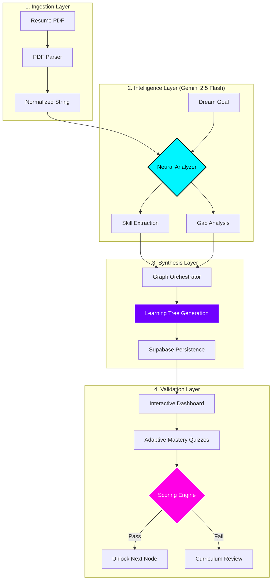

# 🧠 Neuro-Nest: Neural Career Synthesis Engine

[](https://deepmind.google/technologies/gemini/)
[](https://nextjs.org/)
[](https://supabase.com/)
[](https://www.framer.com/motion/)

> **Neuro-Nest** is a high-performance career engineering platform that leverages cutting-edge Large Language Models (LLMs) to synthesize personalized mastery trajectories. By merging neural resume parsing with adaptive graph theory, it engineers the shortest path between your current skill-set and your ultimate professional objectives.

---

## 🏗️ Architectural Workflow

Neuro-Nest operates on a four-stage neural pipeline designed for maximum precision and adaptive learning.



### 🛰️ Stage Details
1.  **Ingestion**: Resumes are deconstructed into structured text blocks using a custom `pdf-parse` utility, stripping noise while preserving semantic context.
2.  **Intelligence**: The **Gemini 2.5 Flash** orchestrator performs a multi-pass analysis. Pass 1 extracts an atomic skill-set; Pass 2 maps those skills against the "Dream Goal" to identify the shortest path to mastery.
3.  **Synthesis**: The **Graph Orchestrator** converts AI logic into a formal JSON Graph (Nodes & Edges), which is then persisted in Supabase to maintain a stateful learning environment.
4.  **Validation**: Users engage with the **Neural Map** via a React Flow interface. Mastery is validated through real-time AI-generated assessments that dynamically unlock sequential learning paths.

---

## 🌌 Key Capabilities

### ⚡ Neural Synthesis Dashboard
An interactive **React Flow** environment that visualizes your professional evolution. 
- **SkillNode Architecture**: Custom nodes with glowing status telemetry and category-specific heuristics.
- **GoalNode Logic**: The "Golden" terminal node representing project completion and objective achievement.

### 🛡️ Adaptive Mastery System
Unlike static roadmaps, Neuro-Nest validates learning through **Cognitive Alignment Tests**.
- **Dynamic Quiz Generation**: Questions are synthesized on-the-fly based on node metadata.
- **Automated State Progression**: Real-time DB triggers unlock dependent nodes only upon successful validation.

### 💎 Premium Cyber-Dark UI
A state-of-the-art interface designed for focus and immersion.
- **High-Contrast Typography**: Optimized visibility for accessibility and prolonged focus.
- **Fluid Animations**: Powered by Framer Motion for a responsive, "alive" feel.

---

## 🛠️ Technical Specification

| Layer | Technology | Purpose |
| :--- | :--- | :--- |
| **Frontend** | Next.js 16 (React 19) | Reactive Application Architecture |
| **Intelligence** | Google Gemini 2.5 Flash | LLM Orchestration & Analysis |
| **Persistence** | Supabase (PostgreSQL) | Stateful Graph & Progress Management |
| **State** | React Flow | Interactive Neural Map Visualization |
| **Animations** | Framer Motion | Fluid UI Transitions & Micro-interactions |
| **Theming** | Tailwind CSS | Custom "Cyber-Dark" Design Tokens |

---

## 🚀 Deployment & Local Execution

### 📋 Prerequisites
- **Node.js**: version 18.0 or higher
- **Supabase**: A free project with the `supabase/schema.sql` initialized in the SQL Editor
- **Gemini AI**: An API key from [Google AI Studio](https://aistudio.google.com/)

### ⚙️ Quick Start (Local)

1. **Environment Setup**:
   Copy the example environment file and populate your keys:
   ```bash
   cp .env.example .env.local
   ```

2. **Automated Initialization**:
   Use the provided synthesis scripts to handle dependency installation and startup:
   - **Git Bash / WSL / Linux**:
     ```bash
     chmod +x run_local.sh
     ./run_local.sh
     ```
   - **Native Windows**: 
     Double-click `run_local.bat` in your file explorer.

3. **Manual Execution**:
   If you prefer manual control:
   ```bash
   npm install
   npm run dev
   ```

The engine will be accessible at: **`http://localhost:8080`**

---


<p align="center">
  <b>Developed for the future of professional engineering.</b><br/>
  <i>Synthesized by Neuro-Nest Core Team</i>
</p>
